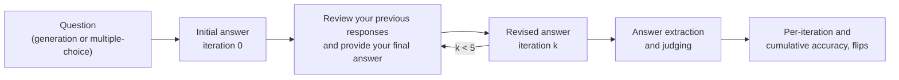

<div align="center">

# Self-Correcting Large Language Models: Generation vs. Multiple Choice

[](https://realm-workshop.github.io/)
[](https://arxiv.org/abs/2511.09381)
[](https://huggingface.co/rahmanidashti)
[](environment.yml)

**Hossein A. Rahmani**<sup>1</sup>, **Satyapriya Krishna**<sup>2</sup>, **Xi Wang**<sup>3</sup>, **Mohammadmehdi Naghiaei**<sup>4</sup>, **Emine Yilmaz**<sup>1</sup>

<sup>1</sup>University College London &nbsp; <sup>2</sup>Amazon AGI &nbsp; <sup>3</sup>University of Sheffield &nbsp; <sup>4</sup>University of Southern California

*REALM: The 2nd Workshop for Research on Agent Language Models at EMNLP 2026*

</div>

---

Large language models can revise their own answers through iterative self-correction, but does this work the same way when a model **writes a free-form answer** as when it **picks one of a few given options**? This repository contains the code for our systematic comparison of the two paradigms across models of different scales and families, prompting strategies, and two benchmarks that provide parallel generation and multiple-choice formulations of the same questions.

## Overview

Each model answers a question (iteration 0) and is then asked to review its previous responses and give a final answer again, for five rounds. The whole conversation history stays in context.



## Key Findings

- **Generation adapts, but drifts.** Open-ended generation improves most in the first one or two iterations, as models fix obvious errors, but later revisions increasingly replace correct answers with incorrect ones (semantic drift).
- **Multiple-choice is stable, but inert.** Multiple-choice selection changes answers rarely and improves gradually, yet a wrong first choice is seldom corrected (*logit inertia*).
- **Scale and prompting help mostly on hard tasks.** Larger models and reasoning-oriented prompts (CoT, self-consistency) give modest gains on DisambiguationQA, while all strategies perform similarly on tinyTruthfulQA.
- **Gains saturate early.** In both paradigms, accuracy largely plateaus after the first one or two rounds of self-correction.

## Experimental Setup

| | |
|---|---|
| **Datasets** | [DisambiguationQA](https://huggingface.co/datasets/rahmanidashti/bbeh-disambiguation-qa) (BIG-Bench Extra Hard) and [tinyTruthfulQA](https://huggingface.co/datasets/rahmanidashti/tiny-truthful-qa), each with a `generation` and a `multiple-choice` config |
| **Models** | SmolLM2-1.7B, Qwen2.5-3B, Llama-3.1-8B, Qwen2.5-14B, DeepSeek-R1-Distill-Llama-8B, Gemini-2.0-Flash |
| **Methods** | Baseline, zero-shot Chain-of-Thought (CoT), Self-Consistency (SC, 5 samples per round) |
| **Iterations** | Initial answer + 5 self-correction rounds |
| **Evaluation** | Multiple-choice: extracted option vs. gold option. Generation: [TruthfulQA truth judge](https://github.com/yizhongw/truthfulqa_reeval) (tinyTruthfulQA) and GPT-4o as LLM-as-a-judge (DisambiguationQA) |

## Repository Structure

```
├── conf/config.yaml        # Hydra config: models, sampling parameters, and the selected run
├── prompts/                # Start and iterative (self-correction) prompts
├── main.py                 # 1. Generates the initial answer and the self-correction iterations
├── run.py                  #    Baseline/CoT and self-consistency loops
├── models.py               #    HuggingFace models and API models (via LiteLLM)
├── answer_process.py       # 2. Extracts the final answer from each response
├── eval.py                 # 3. Judges answers (evaluation.py holds the TruthfulQA judges)
├── result.py               # 4. Computes per-iteration and cumulative accuracy
└── run_experiment.sh       # Runs every configuration from the paper
```

## Installation

```bash
git clone https://github.com/rahmanidashti/task-self-correction.git
cd task-self-correction
conda env create -f environment.yml
conda activate SelfCorrect
```

Qwen2.5-14B is loaded with FlashAttention 2, which requires the CUDA toolkit (`install_cuda_toolkit.sh` installs it on Debian 12).

API keys are read from environment variables:

```bash
export HF_TOKEN=hf_...       # gated HuggingFace models (e.g., Llama-3.1-8B)
export GEMINI_API_KEY=...    # Gemini-2.0-Flash
export OPENAI_API_KEY=...    # GPT-4o judge for DisambiguationQA generation
```

## Usage

A run is defined by [Hydra](https://hydra.cc) overrides on `conf/config.yaml`, and the same overrides are passed to all four pipeline steps:

| Step | Script | Output |
|---|---|---|
| 1. Self-correction iterations | `main.py` | `results/outputs/` |
| 2. Final answer extraction | `answer_process.py` | `results/process/` |
| 3. Judging | `eval.py` | `results/evals/` |
| 4. Accuracy | `result.py` | `results/acc/` |

For example, Qwen2.5-3B with CoT on the generation version of DisambiguationQA:

```bash
ARGS="select.model=Qwen2.5-3B select.dataset=bbeh-disambiguation-qa select.task=generation \
      select.method=CoT select.start_prompt=cot-gen-2 select.iterate_prompt=cot-gen-2 \
      param.temp=1.0 param.top_k=50 param.top_p=0.95"

for script in main.py answer_process.py eval.py result.py; do
    python $script $ARGS
done
```

To run all configurations from the paper:

```bash
bash run_experiment.sh
```

| Option | Values |
|---|---|
| `select.dataset` | `bbeh-disambiguation-qa`, `tiny-truthful-qa` |
| `select.task` | `generation`, `multiple-choice` |
| `select.method` | `baseline`, `CoT`, `self-consistency` |
| `select.start_prompt` / `select.iterate_prompt` | `base-gen-2`, `base-mc1-2`, `cot-gen-2`, `cot-mc1-2` |
| `param.temp` / `param.top_k` / `param.top_p` | Baseline & CoT: `1.0` / `50` / `0.95`; Self-consistency: `0.7` / `20` / `1.0` |

`result.py` writes two accuracy files per run: `iteration/` (accuracy at each round) and `cumulative/` (a question counts as correct from the first round it is answered correctly).

## Citation

If you find this work useful, please cite:

```bibtex
@inproceedings{rahmani2026selfcorrecting,
  title     = {Self-Correcting Large Language Models: Generation vs. Multiple Choice},
  author    = {Rahmani, Hossein A. and Krishna, Satyapriya and Wang, Xi and Naghiaei, Mohammadmehdi and Yilmaz, Emine},
  booktitle = {Proceedings of the 2nd Workshop for Research on Agent Language Models (REALM)},
  address   = {Budapest, Hungary},
  publisher = {Association for Computational Linguistics},
  year      = {2026},
  note      = {Co-located with EMNLP 2026. arXiv:2511.09381}
}
```

## Acknowledgments

This research is supported by the Engineering and Physical Sciences Research Council [EP/S021566/1] and the EPSRC Fellowship titled "Task Based Information Retrieval" [EP/P024289/1].
